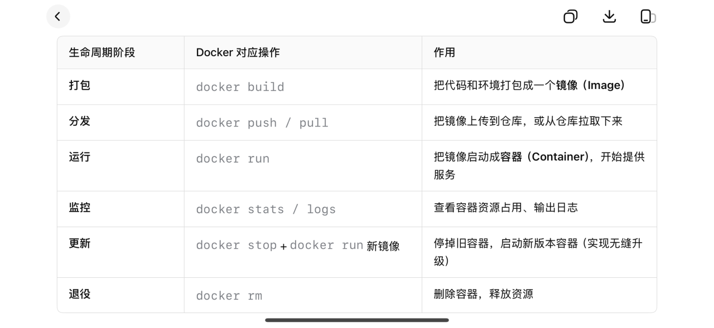
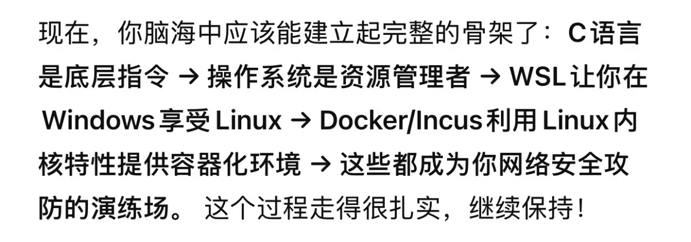

本周是我学习网安的第一周，一开始我被庞大的信息流和各种知识盲区所打压，各种软件各种环境配置，各种操作上的问题，但后来在群里大佬，b站大学很多很多方面去帮助下慢慢成长，第一次接触C语言，用上vscode，成功配置环境，用codex接上deepseek，了解到加速器真正用法（vpn，vps）成功订阅，用上github（真好用），但是看似很多也就仅仅如此，还是个门外汉，各种网安名词也只是知道，没有一点实践过，像打靶，渗透等等…代码也只会一点点基础，我觉得自己就像那愚公挖着一辈子挖不完的山，还是赶紧自己不够努力，下一周继续加油！（第一次编写）

今天有点感慨，渐渐对编程熟练，之前一直觉得电脑就是用来打游戏，现在觉得电脑可以做到太多东西了，到现在虚拟机安装了，kali-liunx，wsl也成功安装（和vscode联动）有一点点小成就，但这仅仅还不够，这就像爆发户什么奢侈品都买了，但每一点内涵，这形容又有点不像，就是一种什么东西都有（其实也没有什么都有哈哈），但在我手上用不出感觉的样子，但没事慢慢学，宝剑会有出鞘那天，这些也应该将会有用！（第二次编写）

刚配置好虚拟机和kali，配置好桌面和各种前置东西，本来想着很开心觉得很好，终于又前进一步，但我又了解到了，原来除了虚拟机配kali还有一个叫做容器的东西 经过了解，所谓容器，以专业的说话是叫做操作系统级别的虚拟化技术，可以把他比作一个根瘤菌，与主机共用同一个养分（系统内核）又独自分别去工作，它与系统有隔离（但也有可能有内核漏洞发生逃逸），而虚拟机就是单独一株植物，拥有自己独自的东西不与主机共用内核，所以容器有独特的优势体量小，运行速度快，对于容器我现在只了解的docker和inchs（学长老大的提供，我后面会再慢慢了解），而对于这两个容器也有区别，docker是一个应用级容器，运用一个应用或进程，inchs是一个操作系统级容器（还有LXC），它模拟一个完整的操作系统（根据ds的说法它更像单独一个轻量级虚拟机，对于使用上的区别，inchs功能更广，可以集群管理，也更安全，而docker更注重一个应用的生命周期（需求与开发，构建与打包，部署与发布，运行与监控，更新与迭代，退役与下线（谢谢ai帮助）），拥有完整且强大的生态

（第三次修改）还有一点想拜托学长，那我是用哪个更好，这应该不着急，等我真的上手了，我估计我应该也会知道要用哪个，我现在想法是inchs，更安全功能更广，因为我的选择困难症非常严重

p.s.附一张图片

最后再次感谢炒饭大佬，vg101大佬，庄三梦大佬，黄恩琦大佬，和deepseek，codex的协助
