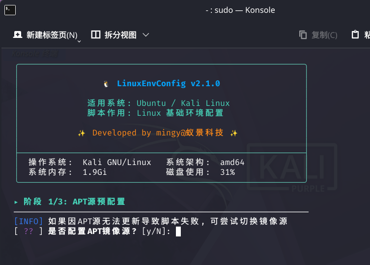

今天算是一周的新开始应“nb”团队的要求，我进行了博客的注册，说起来也惭愧，其实我之前一直都不懂什么是博客，单纯的以为就是像微博一样的存在，但在第一次会议上，我才了解到，原来大佬的博客是这样啊，并不是像博客园和csdn那种一样，有一个单纯的网页，这些网页经过我的了解是通过hwxo或者astor这种静态站点生成器建立的，这两个也有区别，hexo是老款的，是最经典的，它的生态非常成熟；而astor是新兴的，现代web框架，拥有超高的自定义能力和超自由的网站设计。但除了这两个还不足以支撑起一个博客，这时还需要一个“云端部署托管平台”主流的有两种一个是vercel还有一个是cloudflare，通过这些可以使博客成功部署（当然还需要下一些配置软件（类似node））对于这些我要感谢一个博主（番茄煮理人 附上她的博客https://blog.fqzlr.top）谢谢她的指导我才能注册成功，也要感谢底层架构者（https://github.com/CuteLeaf/Firefly）的开源支持，我才能拥有这样的博客，但我觉得唯一不足的是这个博客有些地方存在着前作者的点点滴滴，因为我喜欢全部自己个性化，喜欢自己拥有这个，但我现在没啥实力，这个东西都靠ai（codex）帮我处理改造，现在稍微好一点了，但我希望到后面我能真正创建一个博客，里面堆积着我喜欢的东西，只有我的影子在里面哈哈远大的理想

对于linux的一些理解，这是一个操作系统内核，作为一个开源的内核，有许多开发商进行开发，linux世界的两大根是Debian和Arch（对于这两个的区别也很大，最直观的比喻就是Debain像一个极其稳重并守旧之人，一个拥有稳重气质的一位上位者；而Arch像一个极富创意的年轻人，拥有极丰富的想象力；Debain安装友好并且稳定有多架构支持适合新手，而Arch洁简，持续更新个性化强，但架构只支持x86\_64）Debain衍生出了Ubuntu和kali，对于Ubuntu，它由DHH打造，运用Omaku（Omarchy的姐妹项目），具有现代化开发环境生态成熟，适合新手使用linux，而kali就是专门为网络空间安全所打造的linux，上面集成了绝大多数的工具，Arch衍生出了Omarchy（也是由DHH打造），这个将Arch极复杂的安装优化流程打包好，运用Hyprland核心（一种桌面（有点接近mac，与其类似的还有kde，这个有点接近windows，顺带一提我的kali用的就是kde）使得对新手不友好的Arch简化很多，因为它把复杂的配置过程预安装，形成一个配置精美，开箱即用的桌面，实际上它注重ai，深度集成了ai编码代理，希望为用户提升ai使用效率 其实对于linux最大的特点是，它的所有事都用终端加指令完成，这也是新手使用很难上手的一点（windows和mac用习惯了，双击成瘾，生动形象的比喻）其实也正因为它的开源，让许多可能被激发（可能有一点乱，为什么会去了解这些，也是群里大佬的聊天，名词的不懂激发的兴趣，在周报中总结我的学习）

今天看了一下最简单的ctf靶场攻略，看下来一遍，感觉学会判断很重要，因为这个的知识点碎片化并且也很多样：1.js禁用（js的前台绕过），2.网络协议头捕捉，3.cookie泄露，4.再用robot.txt，5.phps泄露（用index.phps下源码）（这个有点复杂，主要判断复杂，要看content-type，状态码—>200–>不存在真实robot.txt，响应头serve，X-powered-by）6.压缩包源码备份泄露，7.sql注入，8.重叠图片隐写（这个我是真有点没懂，有点复杂）…..还要用到很多工具比如使用远程kali的很多工具，burp等等很多，说实在话，看完这一大堆题型，我觉得实战刷题很重要，一定要判断出题目类型才可以找到方法，就和数学物理理科一样，每种题型有不同解法，要学会归类和整理，先大类后小类这种体系思维，不能死学习和文科一样死背，没什么用的，万变不离其中

其实我好想再谈论下我的一个办法，这个想法在我使用蚁景网络的kali安装脚本

这确实是方便了我们的学习，自动换源，自动安装docker….但这真有利于我们学习吗？对于linux系统最需要掌握的就是在终端里的命令输入，对于以前的人说安装这些东西，就是在慢慢学习，就算弄错也没事，提前创建快照，从头开始再一次磨练，但这个自动化脚步令我们失去了动手学习熟悉的过程，是这确实是大大方便我们，简化流程，适合新手，但这真的好吗？缺失了实操这一步，真的对你学习有用吗这有待推究吧！对于我们这代人来说，又充满机遇，又充满挑战，还充满悲观，我从这个想引生到ai，ai时代确实给我们带来了很多便捷，使很多的入门门槛降低，很多对于新手不友好的事情变得容易，但就是缺少了自己的实操，本来有这实操你可以更深入地了解，虽然费时间，但能快速提高自己的知识掌握，对于我来说我自己博客的搭建大量使用了ai确实使我的博客不错且很方便了我的搭建，但我一点都没有很了解这个都原理，因此我也在这次周报第一条说了我以后会自己再尝试搭建一个完全属于我自己的无论结果如何

p.s.这周学的东西有一点少，生病了人不得劲，效率很低，下周可能会去nssctf和htb看看吧
